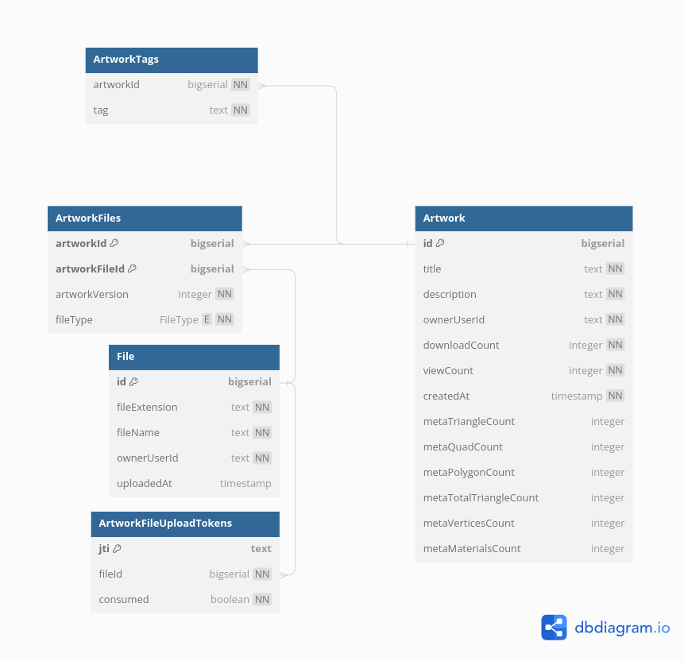

# Database Tables

**These documents reflect the tables in the design stage and may not be up to date. Use as reference only.**



## DBML

The following is a DBML description of the database, Create a diagram at https://dbdiagram.io/ to view it. 

```
// Display: https://dbdiagram.io/
// Docs: https://dbml.dbdiagram.io/docs/


Table File {
  id bigserial [pk]
  sha256 char(64) [not null, unique] // Hash of the whole file. Can be translated into a URI.
  fileExtension text [not null] // Used to select the three.js loader
  ownerUserId bigserial [not null]
  uploadedAt timestamp [not null]
}

Table Artwork {
  id bigserial [pk]
  title text [not null]
  description text [not null]
  ownerUserId bigserial [not null]
  downloadCount integer [not null, default: 0]
  viewCount integer [not null, default: 0]
  createdAt timestamp [not null]
  metaTriangleCount integer
  metaQuadCount integer
  metaPolygonCount integer
  metaTotalTriangleCount integer
  metaVerticesCount integer
  metaMaterialsCount integer
}

Table ArtworkFiles {
  artworkId bigserial [ref: > Artwork.id]
  artworkFileId bigserial [ref: > File.id]
  artworkVersion integer [not null]
  indexes {
    (artworkId, artworkFileId) [pk]
  }
}

Table ArtworkTags {
  artworkId bigserial [ref: > Artwork.id]
  tag text [not null]
}

Table ArtworkFileUploadTokens {
  id text [pk]
  artworkFileId bigserial [ref: > File.id, not null]
  token text [not null]
}
```
